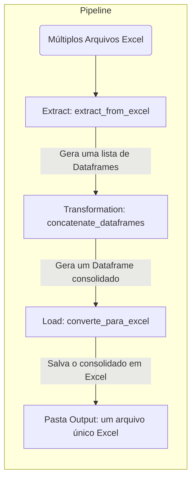

# Workflow

```mermaid

flowchart LR
    subgraph ETL[Pipeline]
        A(Múltiplos Arquivos Excel) --> B[Extract: extract_from_excel]
        B --> |Gera uma lista de Dataframes| C[Transformation: concatenate_dataframes]
        C --> |Gera um Dataframe consolidado| D[Load: converte_para_excel]
        D --> |Salva o consolidado em Excel| E[Pasta Output: um arquivo único Excel]
    end
```
# Função de transformação de dados

### ::: pipeline.extract.extract_from_excel